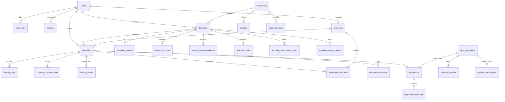

# Travia Database Schema Design
**Version 1.0 - MVP Database Architecture**

## Overview

This document defines the comprehensive database schema for the Travia travel itinerary platform. The schema is designed to support:
- Template-based itinerary creation
- AI-powered customization
- Multi-user collaboration
- Rate negotiation workflows
- Analytics and reporting

## Entity Relationship Diagram



## Core Tables

### 1. users (Enhanced)
**Purpose**: User authentication and profile management

```sql
CREATE TABLE users (
    id UUID PRIMARY KEY REFERENCES auth.users(id) ON DELETE CASCADE,
    email TEXT UNIQUE NOT NULL,
    name TEXT NOT NULL,
    phone TEXT,
    avatar_url TEXT,
    agency_id UUID REFERENCES agencies(id),
    preferences JSONB DEFAULT '{}',
    created_at TIMESTAMPTZ DEFAULT NOW(),
    updated_at TIMESTAMPTZ DEFAULT NOW(),
    last_login TIMESTAMPTZ,
    is_active BOOLEAN DEFAULT TRUE
);
```

### 2. agencies
**Purpose**: Multi-tenancy support for travel agencies

```sql
CREATE TABLE agencies (
    id UUID PRIMARY KEY DEFAULT gen_random_uuid(),
    name TEXT NOT NULL,
    business_registration TEXT,
    contact_email TEXT NOT NULL,
    contact_phone TEXT,
    address JSONB,
    subscription_tier TEXT CHECK (subscription_tier IN ('starter', 'professional', 'enterprise')),
    subscription_status TEXT CHECK (subscription_status IN ('active', 'suspended', 'cancelled')),
    max_agents INTEGER DEFAULT 3,
    settings JSONB DEFAULT '{}',
    created_at TIMESTAMPTZ DEFAULT NOW(),
    updated_at TIMESTAMPTZ DEFAULT NOW()
);
```

### 3. customers
**Purpose**: Traveler profiles and preferences

```sql
CREATE TABLE customers (
    id UUID PRIMARY KEY DEFAULT gen_random_uuid(),
    user_id UUID REFERENCES users(id) ON DELETE SET NULL,
    agent_id UUID REFERENCES users(id) NOT NULL,
    email TEXT NOT NULL,
    name TEXT NOT NULL,
    phone TEXT,
    nationality TEXT,
    travel_preferences JSONB DEFAULT '{}', -- budget range, travel style, dietary restrictions
    travel_history JSONB DEFAULT '[]', -- past trips
    communication_preferences JSONB DEFAULT '{}', -- preferred contact method, language
    notes TEXT,
    created_at TIMESTAMPTZ DEFAULT NOW(),
    updated_at TIMESTAMPTZ DEFAULT NOW()
);
```

## Template System Tables

### 4. destinations
**Purpose**: Southeast Asian destination database

```sql
CREATE TABLE destinations (
    id UUID PRIMARY KEY DEFAULT gen_random_uuid(),
    name TEXT NOT NULL,
    country TEXT NOT NULL,
    region TEXT,
    description TEXT,
    coordinates POINT, -- For mapping
    climate_info JSONB, -- Weather patterns by season
    best_visit_months INTEGER[], -- Array of month numbers
    cultural_info JSONB, -- Customs, etiquette, dress codes
    halal_friendly BOOLEAN DEFAULT FALSE,
    visa_requirements JSONB, -- By nationality
    currency TEXT,
    language TEXT[],
    timezone TEXT,
    average_temperature_range JSONB, -- By season
    popular_activities TEXT[],
    tags TEXT[],
    is_active BOOLEAN DEFAULT TRUE,
    created_at TIMESTAMPTZ DEFAULT NOW(),
    updated_at TIMESTAMPTZ DEFAULT NOW()
);
```

### 5. templates
**Purpose**: Core template storage

```sql
CREATE TABLE templates (
    id UUID PRIMARY KEY DEFAULT gen_random_uuid(),
    name TEXT NOT NULL,
    description TEXT,
    destination_ids UUID[] NOT NULL, -- Array of destination IDs
    duration_days INTEGER NOT NULL CHECK (duration_days > 0),
    category TEXT NOT NULL CHECK (category IN ('family', 'luxury', 'adventure', 'cultural', 'beach', 'budget', 'honeymoon', 'group')),
    travel_type TEXT[] DEFAULT '{}', -- Multiple types possible
    budget_range JSONB NOT NULL, -- {min: number, max: number, currency: string}
    estimated_cost JSONB NOT NULL, -- {min, max, currency, breakdown}
    preview_image_url TEXT,
    preview_description TEXT,
    tags TEXT[],
    
    -- Template metadata
    created_by UUID REFERENCES users(id) NOT NULL,
    agency_id UUID REFERENCES agencies(id),
    is_public BOOLEAN DEFAULT FALSE, -- Shared across agencies
    is_active BOOLEAN DEFAULT TRUE,
    
    -- Version control
    version INTEGER DEFAULT 1,
    parent_template_id UUID REFERENCES templates(id),
    
    -- Analytics
    times_used INTEGER DEFAULT 0,
    success_rate NUMERIC(5,2) DEFAULT 0.00, -- Percentage
    average_rating NUMERIC(3,2) DEFAULT 0.00,
    last_used_at TIMESTAMPTZ,
    
    created_at TIMESTAMPTZ DEFAULT NOW(),
    updated_at TIMESTAMPTZ DEFAULT NOW()
);
```

### 6. template_activities
**Purpose**: Day-by-day activities within templates

```sql
CREATE TABLE template_activities (
    id UUID PRIMARY KEY DEFAULT gen_random_uuid(),
    template_id UUID REFERENCES templates(id) ON DELETE CASCADE,
    day_number INTEGER NOT NULL CHECK (day_number > 0),
    sequence_order INTEGER NOT NULL, -- Order within the day
    time_of_day TEXT CHECK (time_of_day IN ('morning', 'afternoon', 'evening', 'night', 'full_day')),
    start_time TIME,
    
    -- Activity details
    title TEXT NOT NULL,
    description TEXT,
    activity_type TEXT NOT NULL CHECK (activity_type IN ('sightseeing', 'dining', 'entertainment', 'transportation', 'accommodation', 'shopping', 'outdoor', 'adventure', 'cultural', 'relaxation')),
    duration_minutes INTEGER,
    location TEXT,
    coordinates POINT,
    
    -- Pricing
    estimated_cost JSONB, -- {amount, currency, per_person}
    
    -- Customization
    is_customizable BOOLEAN DEFAULT TRUE,
    is_optional BOOLEAN DEFAULT FALSE,
    alternatives JSONB DEFAULT '[]', -- Array of alternative activity options
    
    -- Additional info
    booking_required BOOLEAN DEFAULT FALSE,
    advance_booking_days INTEGER,
    special_requirements TEXT,
    
    created_at TIMESTAMPTZ DEFAULT NOW(),
    updated_at TIMESTAMPTZ DEFAULT NOW(),
    
    UNIQUE(template_id, day_number, sequence_order)
);
```

### 7. template_accommodations
**Purpose**: Accommodation options in templates

```sql
CREATE TABLE template_accommodations (
    id UUID PRIMARY KEY DEFAULT gen_random_uuid(),
    template_id UUID REFERENCES templates(id) ON DELETE CASCADE,
    check_in_day INTEGER NOT NULL,
    check_out_day INTEGER NOT NULL,
    
    -- Accommodation details
    name TEXT NOT NULL,
    type TEXT CHECK (type IN ('hotel', 'resort', 'hostel', 'apartment', 'villa', 'guesthouse')),
    location TEXT NOT NULL,
    coordinates POINT,
    rating_stars NUMERIC(2,1) CHECK (rating_stars >= 1 AND rating_stars <= 5),
    
    -- Room details
    room_type TEXT,
    max_occupancy INTEGER,
    amenities TEXT[],
    
    -- Pricing
    price_per_night JSONB NOT NULL, -- {min, max, currency}
    
    -- Customization
    is_customizable BOOLEAN DEFAULT TRUE,
    alternatives JSONB DEFAULT '[]',
    
    -- Additional info
    special_features TEXT[],
    halal_friendly BOOLEAN DEFAULT FALSE,
    
    created_at TIMESTAMPTZ DEFAULT NOW(),
    updated_at TIMESTAMPTZ DEFAULT NOW()
);
```

### 8. template_meals
**Purpose**: Meal plans in templates

```sql
CREATE TABLE template_meals (
    id UUID PRIMARY KEY DEFAULT gen_random_uuid(),
    template_id UUID REFERENCES templates(id) ON DELETE CASCADE,
    day_number INTEGER NOT NULL,
    meal_type TEXT NOT NULL CHECK (meal_type IN ('breakfast', 'lunch', 'dinner', 'snack')),
    
    -- Meal details
    restaurant_name TEXT,
    cuisine_type TEXT,
    location TEXT,
    coordinates POINT,
    
    -- Pricing
    estimated_cost JSONB, -- {min, max, currency, per_person}
    
    -- Dietary options
    is_halal_available BOOLEAN DEFAULT FALSE,
    is_vegetarian_available BOOLEAN DEFAULT FALSE,
    is_vegan_available BOOLEAN DEFAULT FALSE,
    
    -- Customization
    is_customizable BOOLEAN DEFAULT TRUE,
    is_included BOOLEAN DEFAULT TRUE, -- Included in package or optional
    alternatives JSONB DEFAULT '[]',
    
    created_at TIMESTAMPTZ DEFAULT NOW(),
    updated_at TIMESTAMPTZ DEFAULT NOW()
);
```

### 9. template_customization_rules
**Purpose**: Define what can be customized and constraints

```sql
CREATE TABLE template_customization_rules (
    id UUID PRIMARY KEY DEFAULT gen_random_uuid(),
    template_id UUID REFERENCES templates(id) ON DELETE CASCADE,
    rule_type TEXT NOT NULL CHECK (rule_type IN ('constraint', 'dependency', 'substitution', 'pricing_rule')),
    
    -- Rule definition
    applies_to TEXT NOT NULL, -- 'activity', 'accommodation', 'meal', 'day'
    target_id UUID, -- ID of the specific item (if applicable)
    day_number INTEGER,
    
    -- Rule logic (stored as JSONB for flexibility)
    rule_config JSONB NOT NULL,
    -- Examples:
    -- Constraint: {"type": "time_window", "min_hours": 2, "max_hours": 4}
    -- Dependency: {"requires": ["activity_id_1"], "conflicts_with": ["activity_id_2"]}
    -- Substitution: {"can_replace": ["activity_id_3"], "price_adjustment": 50}
    
    error_message TEXT, -- Message to show if rule violated
    is_active BOOLEAN DEFAULT TRUE,
    
    created_at TIMESTAMPTZ DEFAULT NOW(),
    updated_at TIMESTAMPTZ DEFAULT NOW()
);
```

### 10. template_usage_analytics
**Purpose**: Track template performance

```sql
CREATE TABLE template_usage_analytics (
    id UUID PRIMARY KEY DEFAULT gen_random_uuid(),
    template_id UUID REFERENCES templates(id) ON DELETE CASCADE,
    itinerary_id UUID REFERENCES itineraries(id) ON DELETE SET NULL,
    agent_id UUID REFERENCES users(id),
    
    -- Usage metrics
    customization_count INTEGER DEFAULT 0,
    time_to_complete_minutes INTEGER,
    customer_rating INTEGER CHECK (customer_rating >= 1 AND customer_rating <= 5),
    customer_feedback TEXT,
    
    -- Outcome
    status TEXT CHECK (status IN ('created', 'shared', 'approved', 'booked', 'cancelled', 'abandoned')),
    conversion_to_booking BOOLEAN DEFAULT FALSE,
    total_value NUMERIC(10,2),
    
    created_at TIMESTAMPTZ DEFAULT NOW(),
    completed_at TIMESTAMPTZ
);
```

## Itinerary System Tables

### 11. itineraries
**Purpose**: Customer-specific itineraries based on templates

```sql
CREATE TABLE itineraries (
    id UUID PRIMARY KEY DEFAULT gen_random_uuid(),
    template_id UUID REFERENCES templates(id),
    agent_id UUID REFERENCES users(id) NOT NULL,
    customer_id UUID REFERENCES customers(id),
    
    -- Basic info
    title TEXT NOT NULL,
    description TEXT,
    destination_ids UUID[] NOT NULL,
    
    -- Dates
    start_date DATE,
    end_date DATE,
    duration_days INTEGER NOT NULL,
    
    -- Travelers
    number_of_travelers INTEGER NOT NULL CHECK (number_of_travelers > 0),
    traveler_details JSONB DEFAULT '[]', -- Array of traveler info
    
    -- Itinerary data (denormalized for performance)
    itinerary_data JSONB NOT NULL, -- Complete day-by-day structure
    
    -- Pricing
    base_price NUMERIC(10,2),
    customization_adjustments NUMERIC(10,2) DEFAULT 0,
    total_price NUMERIC(10,2),
    currency TEXT DEFAULT 'USD',
    pricing_breakdown JSONB,
    
    -- Status
    status TEXT NOT NULL DEFAULT 'draft' CHECK (status IN ('draft', 'review', 'shared', 'modified', 'approved', 'confirmed', 'booked', 'cancelled')),
    approval_status TEXT CHECK (approval_status IN ('pending', 'approved', 'rejected', 'needs_revision')),
    
    -- Sharing
    shared_token TEXT UNIQUE,
    shared_at TIMESTAMPTZ,
    share_expires_at TIMESTAMPTZ,
    
    -- Metadata
    preferences TEXT,
    special_requests TEXT,
    notes TEXT, -- Internal agent notes
    
    created_at TIMESTAMPTZ DEFAULT NOW(),
    updated_at TIMESTAMPTZ DEFAULT NOW(),
    confirmed_at TIMESTAMPTZ
);
```

### 12. itinerary_customizations
**Purpose**: Track all customizations made to itineraries

```sql
CREATE TABLE itinerary_customizations (
    id UUID PRIMARY KEY DEFAULT gen_random_uuid(),
    itinerary_id UUID REFERENCES itineraries(id) ON DELETE CASCADE,
    made_by UUID REFERENCES users(id), -- Agent or customer
    
    -- Customization details
    customization_type TEXT NOT NULL CHECK (customization_type IN ('activity_added', 'activity_removed', 'activity_modified', 'accommodation_changed', 'meal_changed', 'date_changed', 'travelers_changed')),
    target_type TEXT NOT NULL, -- 'activity', 'accommodation', 'meal', 'day'
    target_id TEXT, -- Reference to the item being customized
    day_number INTEGER,
    
    -- Changes
    previous_value JSONB,
    new_value JSONB,
    
    -- Impact
    price_impact NUMERIC(10,2) DEFAULT 0,
    reason TEXT,
    
    created_at TIMESTAMPTZ DEFAULT NOW()
);
```

### 13. itinerary_shares
**Purpose**: Track itinerary sharing history

```sql
CREATE TABLE itinerary_shares (
    id UUID PRIMARY KEY DEFAULT gen_random_uuid(),
    itinerary_id UUID REFERENCES itineraries(id) ON DELETE CASCADE,
    shared_by UUID REFERENCES users(id) NOT NULL,
    shared_with_email TEXT NOT NULL,
    share_token TEXT UNIQUE NOT NULL,
    
    -- Access control
    access_level TEXT DEFAULT 'view' CHECK (access_level IN ('view', 'comment', 'edit')),
    expires_at TIMESTAMPTZ,
    is_active BOOLEAN DEFAULT TRUE,
    
    -- Tracking
    first_viewed_at TIMESTAMPTZ,
    last_viewed_at TIMESTAMPTZ,
    view_count INTEGER DEFAULT 0,
    
    created_at TIMESTAMPTZ DEFAULT NOW()
);
```

### 14. modification_requests
**Purpose**: Customer feedback and change requests

```sql
CREATE TABLE modification_requests (
    id UUID PRIMARY KEY DEFAULT gen_random_uuid(),
    itinerary_id UUID REFERENCES itineraries(id) ON DELETE CASCADE,
    customer_id UUID REFERENCES customers(id),
    
    -- Request details
    request_type TEXT CHECK (request_type IN ('change_activity', 'change_accommodation', 'change_dates', 'add_activity', 'remove_activity', 'budget_concern', 'other')),
    day_number INTEGER,
    target_id TEXT,
    
    -- Request content
    request_text TEXT NOT NULL,
    priority TEXT DEFAULT 'normal' CHECK (priority IN ('low', 'normal', 'high', 'urgent')),
    
    -- Response
    status TEXT DEFAULT 'pending' CHECK (status IN ('pending', 'reviewing', 'approved', 'rejected', 'implemented')),
    agent_response TEXT,
    responded_by UUID REFERENCES users(id),
    responded_at TIMESTAMPTZ,
    
    created_at TIMESTAMPTZ DEFAULT NOW()
);
```

### 15. conversation_history
**Purpose**: AI conversation logs for itinerary building

```sql
CREATE TABLE conversation_history (
    id UUID PRIMARY KEY DEFAULT gen_random_uuid(),
    itinerary_id UUID REFERENCES itineraries(id) ON DELETE CASCADE,
    user_id UUID REFERENCES users(id) NOT NULL,
    user_role TEXT NOT NULL CHECK (user_role IN ('agent', 'traveler', 'ai')),
    
    -- Message
    message_type TEXT CHECK (message_type IN ('text', 'template_suggestion', 'customization', 'pricing_update', 'system')),
    message_content TEXT NOT NULL,
    message_data JSONB, -- Structured data (e.g., template IDs, pricing)
    
    -- AI context
    intent_detected TEXT,
    entities_extracted JSONB,
    confidence_score NUMERIC(3,2),
    
    -- Conversation flow
    parent_message_id UUID REFERENCES conversation_history(id),
    
    created_at TIMESTAMPTZ DEFAULT NOW()
);
```

## Provider & Negotiation Tables (Phase 2 Ready)

### 16. service_providers
**Purpose**: Provider directory

```sql
CREATE TABLE service_providers (
    id UUID PRIMARY KEY DEFAULT gen_random_uuid(),
    name TEXT NOT NULL,
    type TEXT NOT NULL CHECK (type IN ('hotel', 'tour_operator', 'transportation', 'restaurant', 'activity_provider', 'guide')),
    
    -- Contact
    contact_email TEXT NOT NULL,
    contact_phone TEXT,
    contact_person TEXT,
    website TEXT,
    
    -- Location
    country TEXT NOT NULL,
    city TEXT,
    address TEXT,
    coordinates POINT,
    
    -- Service details
    service_categories TEXT[],
    geographical_coverage TEXT[],
    specializations TEXT[],
    
    -- Pricing model
    pricing_structure JSONB,
    accepts_group_bookings BOOLEAN DEFAULT FALSE,
    minimum_booking_notice_days INTEGER,
    
    -- Business terms
    payment_terms TEXT,
    cancellation_policy TEXT,
    
    -- Relationship
    relationship_score NUMERIC(3,2) DEFAULT 0.00, -- 0-5 score
    preferred_provider BOOLEAN DEFAULT FALSE,
    
    -- Status
    is_active BOOLEAN DEFAULT TRUE,
    verified BOOLEAN DEFAULT FALSE,
    
    created_at TIMESTAMPTZ DEFAULT NOW(),
    updated_at TIMESTAMPTZ DEFAULT NOW()
);
```

### 17. provider_services
**Purpose**: Specific services offered by providers

```sql
CREATE TABLE provider_services (
    id UUID PRIMARY KEY DEFAULT gen_random_uuid(),
    provider_id UUID REFERENCES service_providers(id) ON DELETE CASCADE,
    
    -- Service details
    service_name TEXT NOT NULL,
    service_type TEXT NOT NULL,
    description TEXT,
    
    -- Availability
    available_from DATE,
    available_until DATE,
    seasonal_availability JSONB,
    
    -- Capacity
    max_capacity INTEGER,
    min_group_size INTEGER,
    
    -- Pricing
    base_price NUMERIC(10,2) NOT NULL,
    currency TEXT DEFAULT 'USD',
    price_per TEXT CHECK (price_per IN ('person', 'group', 'unit', 'hour', 'day')),
    volume_discounts JSONB DEFAULT '[]',
    
    -- Terms
    includes TEXT[],
    excludes TEXT[],
    requirements TEXT[],
    
    is_active BOOLEAN DEFAULT TRUE,
    created_at TIMESTAMPTZ DEFAULT NOW(),
    updated_at TIMESTAMPTZ DEFAULT NOW()
);
```

### 18. negotiations
**Purpose**: Rate negotiation tracking

```sql
CREATE TABLE negotiations (
    id UUID PRIMARY KEY DEFAULT gen_random_uuid(),
    itinerary_id UUID REFERENCES itineraries(id),
    agent_id UUID REFERENCES users(id) NOT NULL,
    provider_id UUID REFERENCES service_providers(id) NOT NULL,
    
    -- Negotiation details
    service_type TEXT NOT NULL,
    service_description TEXT NOT NULL,
    required_date DATE,
    quantity INTEGER,
    
    -- Pricing
    target_price NUMERIC(10,2),
    offered_price NUMERIC(10,2),
    final_price NUMERIC(10,2),
    currency TEXT DEFAULT 'USD',
    
    -- Status
    status TEXT DEFAULT 'initiated' CHECK (status IN ('initiated', 'sent', 'pending_response', 'negotiating', 'accepted', 'rejected', 'expired', 'cancelled')),
    
    -- Timing
    response_deadline TIMESTAMPTZ,
    follow_up_count INTEGER DEFAULT 0,
    last_follow_up_at TIMESTAMPTZ,
    
    -- Outcome
    accepted_at TIMESTAMPTZ,
    rejected_at TIMESTAMPTZ,
    rejection_reason TEXT,
    
    created_at TIMESTAMPTZ DEFAULT NOW(),
    updated_at TIMESTAMPTZ DEFAULT NOW()
);
```

### 19. negotiation_messages
**Purpose**: Communication log for negotiations

```sql
CREATE TABLE negotiation_messages (
    id UUID PRIMARY KEY DEFAULT gen_random_uuid(),
    negotiation_id UUID REFERENCES negotiations(id) ON DELETE CASCADE,
    sender_type TEXT NOT NULL CHECK (sender_type IN ('agent', 'provider', 'ai', 'system')),
    sender_id UUID REFERENCES users(id),
    
    -- Message
    message_type TEXT CHECK (message_type IN ('initial_request', 'response', 'counter_offer', 'question', 'acceptance', 'rejection', 'follow_up')),
    subject TEXT,
    body TEXT NOT NULL,
    
    -- AI generation (if applicable)
    ai_generated BOOLEAN DEFAULT FALSE,
    ai_template_used TEXT,
    
    -- Communication channel
    channel TEXT CHECK (channel IN ('email', 'platform', 'phone', 'whatsapp')),
    channel_metadata JSONB,
    
    -- Tracking
    sent_at TIMESTAMPTZ,
    delivered_at TIMESTAMPTZ,
    read_at TIMESTAMPTZ,
    
    created_at TIMESTAMPTZ DEFAULT NOW()
);
```

### 20. provider_performance
**Purpose**: Track provider performance metrics

```sql
CREATE TABLE provider_performance (
    id UUID PRIMARY KEY DEFAULT gen_random_uuid(),
    provider_id UUID REFERENCES service_providers(id) ON DELETE CASCADE,
    measured_period_start DATE NOT NULL,
    measured_period_end DATE NOT NULL,
    
    -- Performance metrics
    total_negotiations INTEGER DEFAULT 0,
    successful_negotiations INTEGER DEFAULT 0,
    success_rate NUMERIC(5,2) DEFAULT 0.00,
    average_response_time_hours NUMERIC(6,2),
    average_discount_percentage NUMERIC(5,2),
    
    -- Reliability
    on_time_delivery_rate NUMERIC(5,2) DEFAULT 0.00,
    cancellation_rate NUMERIC(5,2) DEFAULT 0.00,
    customer_satisfaction_score NUMERIC(3,2),
    
    -- Business value
    total_bookings INTEGER DEFAULT 0,
    total_revenue NUMERIC(12,2) DEFAULT 0.00,
    currency TEXT DEFAULT 'USD',
    
    created_at TIMESTAMPTZ DEFAULT NOW()
);
```

## Indexes

### Performance Indexes
```sql
-- Users and authentication
CREATE INDEX idx_users_agency_id ON users(agency_id);
CREATE INDEX idx_users_email ON users(email);

-- Templates
CREATE INDEX idx_templates_category ON templates(category);
CREATE INDEX idx_templates_destinations ON templates USING GIN(destination_ids);
CREATE INDEX idx_templates_created_by ON templates(created_by);
CREATE INDEX idx_templates_agency_id ON templates(agency_id);
CREATE INDEX idx_templates_active ON templates(is_active) WHERE is_active = TRUE;

-- Itineraries
CREATE INDEX idx_itineraries_agent_id ON itineraries(agent_id);
CREATE INDEX idx_itineraries_customer_id ON itineraries(customer_id);
CREATE INDEX idx_itineraries_template_id ON itineraries(template_id);
CREATE INDEX idx_itineraries_status ON itineraries(status);
CREATE INDEX idx_itineraries_shared_token ON itineraries(shared_token);
CREATE INDEX idx_itineraries_dates ON itineraries(start_date, end_date);

-- Negotiations
CREATE INDEX idx_negotiations_agent_id ON negotiations(agent_id);
CREATE INDEX idx_negotiations_provider_id ON negotiations(provider_id);
CREATE INDEX idx_negotiations_status ON negotiations(status);
CREATE INDEX idx_negotiations_itinerary_id ON negotiations(itinerary_id);

-- Providers
CREATE INDEX idx_providers_type ON service_providers(type);
CREATE INDEX idx_providers_country ON service_providers(country);
CREATE INDEX idx_providers_active ON service_providers(is_active) WHERE is_active = TRUE;
```

### Full-text Search Indexes
```sql
-- Template search
CREATE INDEX idx_templates_search ON templates USING GIN(to_tsvector('english', name || ' ' || COALESCE(description, '')));

-- Destination search
CREATE INDEX idx_destinations_search ON destinations USING GIN(to_tsvector('english', name || ' ' || COALESCE(description, '')));
```

## Row-Level Security (RLS) Policies

All tables will have RLS enabled with appropriate policies based on user roles. See migration file for detailed policies.

## Triggers

### Auto-update timestamps
```sql
CREATE OR REPLACE FUNCTION update_updated_at_column()
RETURNS TRIGGER AS $$
BEGIN
    NEW.updated_at = NOW();
    RETURN NEW;
END;
$$ language 'plpgsql';

-- Apply to all tables with updated_at column
CREATE TRIGGER update_users_updated_at BEFORE UPDATE ON users FOR EACH ROW EXECUTE FUNCTION update_updated_at_column();
-- ... (repeat for all tables)
```

### Template usage counter
```sql
CREATE OR REPLACE FUNCTION increment_template_usage()
RETURNS TRIGGER AS $$
BEGIN
    UPDATE templates SET times_used = times_used + 1, last_used_at = NOW() WHERE id = NEW.template_id;
    RETURN NEW;
END;
$$ language 'plpgsql';

CREATE TRIGGER increment_template_usage_trigger AFTER INSERT ON itineraries FOR EACH ROW EXECUTE FUNCTION increment_template_usage();
```

## Migration Strategy

1. **Phase 1**: Core tables (users, agencies, customers, destinations)
2. **Phase 2**: Template system (templates + related tables)
3. **Phase 3**: Itinerary system (itineraries + related tables)
4. **Phase 4**: Provider/negotiation system (providers + negotiations)
5. **Phase 5**: Analytics and performance tables

Each phase includes:
- Table creation
- Index creation
- RLS policies
- Trigger functions
- Seed data (where applicable)
